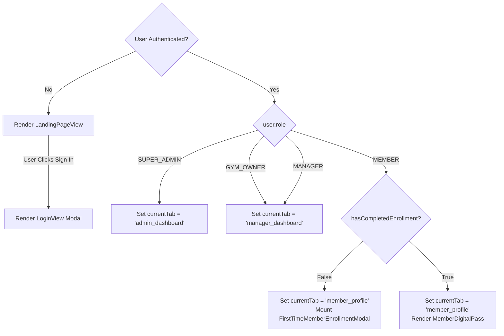
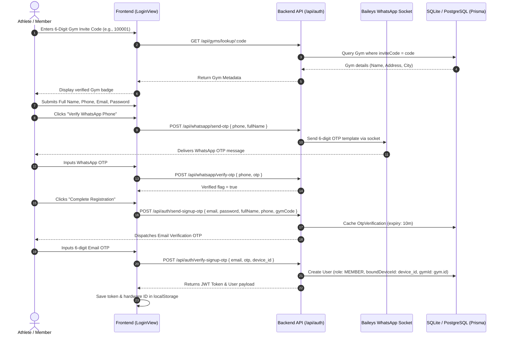
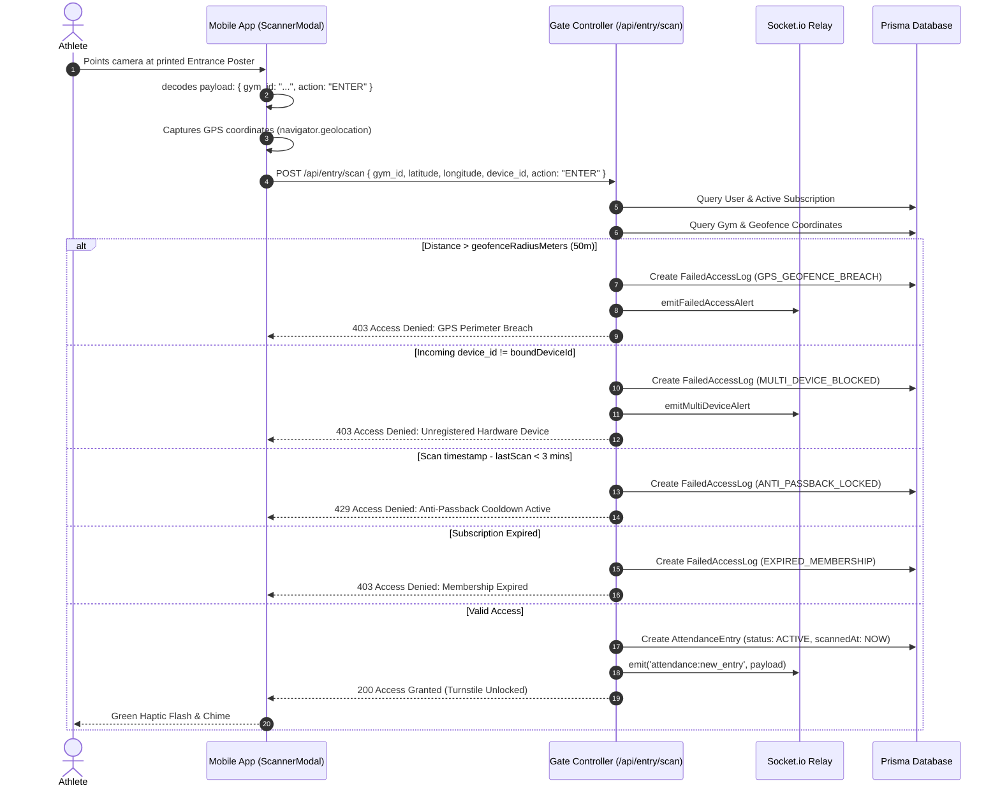
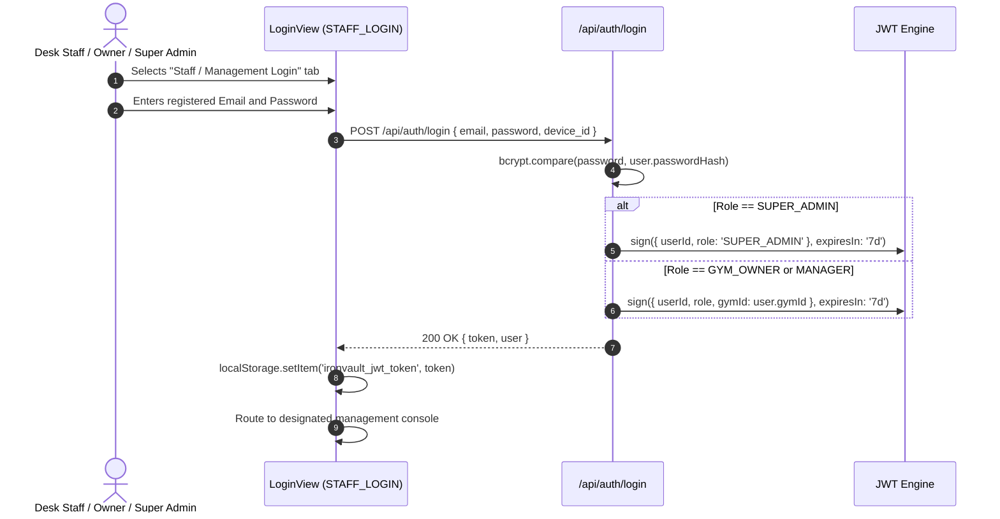

# Comprehensive Architectural, UI & Data Flow Specification: FIDGIT Gym CRM

---

## 1. System Roles & Access Matrix

FIDGIT enforces a multi-tenant Role-Based Access Control (RBAC) model operating across four distinct user roles defined in the database schema (`User.role`): **`MEMBER`**, **`MANAGER`** (Desk Staff), **`GYM_OWNER`** (Gym Admin), and **`SUPER_ADMIN`** (Platform Developer/Operator).

### 1.1 Role Definitions & Permission Matrix

| Capability / Action | `MEMBER` | `MANAGER` (Desk Staff) | `GYM_OWNER` (Admin) | `SUPER_ADMIN` (Developer) |
| :--- | :---: | :---: | :---: | :---: |
| **Tenant / Workspace Boundary** | Bound to single `gymId` | Bound to single `gymId` | Manages single `gymId` | Global / Cross-Tenant (All Gyms) |
| **View Digital Membership Card / Dynamic QR** | YES | NO | NO | NO |
| **Scan Turnstile Gate (Self Check-in / Check-out)** | YES | NO (Staff pass only) | NO | YES (Diagnostic override) |
| **Workout Timer & Daily Split Logger** | YES | NO | NO | NO |
| **Submit First-Time KYC Admission Form** | YES | NO (Assisted via Desk) | NO | NO |
| **Download Stamped Bill & KYC Form (PDF)** | YES (Own docs only) | YES (All gym members) | YES (All gym members) | YES (Any tenant) |
| **Live Attendance Floor Monitor** | NO | YES | YES | YES |
| **Manual Desk Check-out (Emergency/Desk Override)**| NO | YES | YES | YES |
| **Desk Billing & Pass Renewal** | NO | YES | YES | YES |
| **Onboard New Member at Desk** | NO | YES | YES | YES |
| **Delete Member Record** | NO | YES (Assigned gym) | YES (Assigned gym) | YES (Platform-wide) |
| **Export Member Roster to CSV** | NO | YES | YES | YES |
| **Health Intelligence & Lead Analytics** | NO | YES | YES | YES |
| **Manage Device Approvals (Multi-Device Conflicts)**| NO | YES | YES | YES |
| **Print Entrance/Exit Gate QR Posters** | NO | YES | YES | YES |
| **Configure Facility GPS Geofence & Coordinates** | NO | NO | YES | YES |
| **Link WhatsApp Multi-Device QR Socket** | NO | YES | YES | YES |
| **Dispatch / Resend WhatsApp Bills & KYC PDFs** | NO | YES | YES | YES |
| **Trigger Platform Expiry Notification Sweep** | NO | YES | YES | YES |
| **Provision New Gym Tenant Workspaces** | NO | NO | NO | YES |
| **Inspect System-Wide Edge Latency & Gate Uptime** | NO | NO | NO | YES |
| **Lock / Whitelist Multi-Branch Fraud Anomalies** | NO | NO | NO | YES |
| **Export Master Platform Archive (All Gyms + Users)**| NO | NO | NO | YES |
| **Publish Official Community Announcements** | NO | YES | YES | YES |
| **Post Member Workout PRs & High-Fives** | YES | YES | YES | YES |

---

### 1.2 Role-Based Redirection Logic Upon Authentication

Post-authentication redirection occurs within `client/src/App.tsx` (`useEffect` on `user.role`):



1. **Unauthenticated Users**: Routed to `LandingPageView`. If they click "Sign In", "Get Started", or a Pricing Tier, `showAuthScreen = true` renders `LoginView` with the designated sub-tab (`MEMBER_LOGIN`, `STAFF_LOGIN`, `SIGNUP`, or `REGISTER_BUSINESS`).
2. **`SUPER_ADMIN`**: Defaults to `currentTab = 'admin_dashboard'` (`SuperAdminDashboard.tsx`).
3. **`GYM_OWNER` & `MANAGER`**: Default to `currentTab = 'manager_dashboard'` (`ManagerDashboard.tsx`).
4. **`MEMBER`**: Defaults to `currentTab = 'member_profile'` (`MemberProfile.tsx`). If `user.hasCompletedEnrollment === false`, the application automatically mounts `FirstTimeMemberEnrollmentModal.tsx` over the viewport.
5. **Direct Public Site Preview**: Authenticated staff can toggle `viewPublicSiteAsUser = true` via the top navbar button to review the public landing page without signing out.

---

## 2. Auth & QR Session Workflows

### 2.1 Member Sign-In, Sign-Up, and Gym Assignment



#### Form Fields & Validation Rules
- **Gym Lookup Code (`gymCode`)**: Exactly 6 alphanumeric digits. Must match an active `Gym.inviteCode`.
- **Full Name (`fullName`)**: String, >= 2 characters.
- **Phone Number (`newPhone` / `whatsAppPhone`)**: E.164 or 10-digit standard Indian/International format. Required for WhatsApp OTP delivery.
- **Email Address (`newEmail` / `email`)**: Valid RFC 5322 email string. Must be unique in the `User` table.
- **Password (`newPassword`)**: Minimum 6 characters.
- **Hardware Device ID (`device_id`)**: Generated on the client via `getOrSetDeviceId()` (UUIDv4 stored in `localStorage` as `ironvault_hardware_device_id`). Automatically bound to the user record on initial verification.

#### Unique Gym Code Generation & Assignment Logic
When a gym owner registers (`POST /api/auth/register-business`):
1. An optional custom 6-digit code can be specified.
2. If omitted, the system executes an entropy loop generating a 6-digit integer string (`Math.floor(100000 + Math.random() * 900000)`).
3. The server queries `prisma.gym.findUnique({ where: { inviteCode } })`. If colliding, it regenerates until unique.
4. Static gate QR tokens (`staticQrCodeHash` and `exitQrCodeHash`) are simultaneously derived as cryptographically random hex strings.

---

### 2.2 QR Code Login & Physical Turnstile Lifecycle

FIDGIT supports a **Dual-Directional QR Architecture**:
- **Member In-App Scans Static Wall Poster**: The athlete scans the printed gym entrance or exit poster.
- **Gate / Front-Desk Tablet Scans Dynamic Member Pass**: The kiosk camera scans the athlete's in-app rotating pass.



#### Encoded QR Data Structures

1. **Static Entrance Gate Poster QR**:
```json
{
  "gym_id": "7b8f9e12-4c3a-4a8b-9d21-1f9e8a7b6c5d",
  "action": "ENTER",
  "name": "Iron Peak Fitness - Main Entrance",
  "hash": "a4f89b2c3d4e5f6a"
}
```

2. **Static Exit Gate Poster QR**:
```json
{
  "gym_id": "7b8f9e12-4c3a-4a8b-9d21-1f9e8a7b6c5d",
  "action": "EXIT",
  "name": "Iron Peak Fitness - Exit Turnstile",
  "hash": "e1f2a3b4c5d6e7f8"
}
```

3. **Dynamic Member In-App Pass**:
Encodes a JSON string containing the member's `userId`, `gymId`, current membership `passId`, and an anti-screenshot counter refreshed every 30 seconds (`secondsLeft`).

#### Session Logging & Turnstile Exit Lifecycle
- **Arrival**: `AttendanceEntry` created with `status: 'ACTIVE'`, `scannedAt = now()`, and `cooldownExpiresAt = now() + 3 minutes`.
- **In-Gym Workout**: The client maintains a live elapsed stopwatch calculated from `scannedAt`.
- **Departure**:
  - Member scans the Exit QR or clicks "Finish Workout" (`POST /api/entry/exit`).
  - Backend updates the active entry: `status = 'COMPLETED'`, `exitedAt = now()`, `sessionDurationMinutes = round((exitedAt - scannedAt) / 60000)`.
  - Broadcasts `attendance:member_exited` over WebSockets to decrement live floor occupancy count.
  - Client pops open `WorkoutDepartureModal.tsx` displaying workout duration, calories burned estimate, and celebration animation.

---

### 2.3 Admin and Super Admin Authentication Flows



#### Forgot Password Lifecycle (Gmail OTP Recovery)
1. Staff or Member clicks "Forgot Password?" in `LoginView`.
2. Step 1 (`EMAIL`): Submits registered email. Server verifies existence, generates 6-digit OTP, saves it in `OtpVerification` (expiry 10 minutes), and sends a security email.
3. Step 2 (`OTP`): User submits email OTP, `newPassword`, and `confirmPassword`.
4. Server hashes password with `bcryptjs` (salt factor 10), updates `User.passwordHash`, deletes used OTP record, and auto-logs the user in.

---

## 3. Developer Console / Super Admin Capabilities

The Super Admin Console (`SuperAdminDashboard.tsx`) provides high-privilege oversight across all tenant databases, network gateways, and security anomalies.

```
+----------------------------------------------------------------------------------+
|                             SUPER ADMIN DASHBOARD                                |
+-------------------------+----------------------------+---------------------------+
|  Active Gyms: [ 12 ]    |  Total Athletes: [ 1,489 ] |  Uptime: [ 99.98% ]       |
+-------------------------+----------------------------+---------------------------+
|  [Turnstile Latency Visualizer: P99 18ms] [Connected Gateways: 12/12 Operational]|
+----------------------------------------------------------------------------------+
|  SECURITY ALERTS & ANOMALIES:                                                    |
|  - Alert #SEC-9021: Cross-Branch Simultaneous Scan -> [ Lock Pass at All Gates ] |
|  - Alert #SEC-9019: Unregistered Phone / Cloned QR -> [ Whitelist ] [ Lock Pass ]|
+----------------------------------------------------------------------------------+
|  DATA DIRECTORIES (Toggleable Tabs):                                             |
|  [ GYMS DIRECTORY ]                                [ ATHLETES DIRECTORY ]        |
|  - Gym Facility / Access Code                      - Athlete Full Name / Contact |
|  - Owner Name & Email                              - Assigned Gym Workspace      |
|  - Registered Athletes Count                       - Plan & Monthly Rate         |
|  - Total Scans Count                               - Active/Expired Status       |
|  - Quick Actions: [ Copy Code ] [ Join Link ]      - Actions: [ Delete Record ]  |
+----------------------------------------------------------------------------------+
```

### 3.1 Maintenance, Troubleshooting & Override Actions

1. **Multi-Tenant Provisioning Modal (`isCreateGymModalOpen`)**:
   - Provisions an enterprise gym workspace directly into the database.
   - Fields: Gym Business Name, 6-Digit Access Code (auto-generated or manual), Owner Name, Owner Gmail, Owner Phone, Initial Password, Physical Street Address, City, State.
   - Action: Calls `api.registerBusiness(...)`, displays 1-click "Copy Credentials" card to dispatch directly to the gym owner.

2. **Cross-Tenant Fraud Overrides**:
   - **Simultaneous Scan Anomaly**: Toggles `anomaly1Locked` to enforce global gate lockout against suspected credential sharing across geographically separated branches.
   - **Hardware Clone Anomaly**: Toggles `anomaly2Locked` (revoke pass) or `anomaly2Whitelisted` (approves the new hardware device and clears threat status).

3. **Global Member Expulsion**:
   - `handleDeleteMember(id, name)`: Issues `DELETE /api/memberships/members/:id`. Permanently cascades and purges active sessions, attendance logs, subscriptions, and KYC forms across the platform.

4. **Master CSV Archive Downloads**:
   - **`handleExportGymsCsv`**: Exports every gym workspace with full metadata, owner contacts, athlete headcount, check-in totals, and creation dates.
   - **`handleExportMembersCsv`**: Exports every athlete across all tenants with subscription rates, expiry dates, and assigned gym invite codes.
   - **`handleExportMasterArchive`**: Triggers batch generation and dual download of both files.

### 3.2 Data Tables & Status Indicators Exposed

#### Gym Fleet Table (`activeTab === 'GYMS'`)
- **Columns**: Facility Index, Gym Facility Name, 6-Digit Access Code (`#inviteCode`), Owner Contact (Name, Email, copy button), Physical Location (City, State, Address), Registered Athletes Count, Total Attendance Scans Count, Quick Actions (`Copy Code`, `Copy Join Link`).
- **Filters**: Real-time text search across gym name, invite code, city, state, and owner email.

#### Platform Athletes Table (`activeTab === 'MEMBERS'`)
- **Columns**: Athlete Avatar & Name, Contact (Email, Phone, copy email button), Assigned Gym Name & Invite Code, Pass Plan Name & Monthly Rate (`$price/mo`), Access Status (`ACTIVE` emerald pulse vs `INACTIVE` neutral), Valid Until Expiry Date, Delete Action button.
- **Filters**: Gym workspace filter dropdown (filter by specific gym ID or All), Status filter dropdown (`ALL`, `ACTIVE`, `INACTIVE`), and full-text search.

---

## 4. Page-by-Page & View-by-View Inventory

### View 1: Public Landing Page (`LandingPageView.tsx`)
- **Route / Mode**: Default view when `user === null` and `showAuthScreen === false`.
- **Permitted Roles**: Public (Unauthenticated visitors) and Authenticated users in preview mode (`viewPublicSiteAsUser === true`).
- **UI Elements**:
  - Sticky Top Bar: Brand logo, "About", "Features", "Showcase", "Pricing", "Contact", Sign In button, "Provision Gym" CTA.
  - Hero Section: Headline, turnstile-free value proposition, interactive check-in simulator widget, "Start 14-Day Free Trial" button, "Explore Demo Pass" button.
  - Gym Equipment Showcase (`GymEquipmentShowcase.tsx`): Interactive 3D/carousel asset showcase.
  - Bodybuilding Athletes Spotlight (`BodybuildingAthletesSpotlight.tsx`): Member success stories and PR badges.
  - Interactive Bodybuilding Anatomy Map (`BodybuildingAnatomyMap.tsx`): Interactive muscle group selector.
  - Commercial Pricing Table: 3 tiers ("Starter Gym", "Pro Fitness Hub", "Enterprise Multi-Branch") with monthly rates and "Choose Plan" buttons that auto-forward to registration with plan pre-selected.
- **Component States**:
  - *Idle*: Clean animated dark mode layout.
  - *Plan Selected*: Clicking plan button sets `authSelectedPlan` and navigates to `LoginView`.

---

### View 2: Authentication & Onboarding Gateway (`LoginView.tsx`)
- **Route / Mode**: Rendered when `showAuthScreen === true`.
- **Permitted Roles**: Public visitors.
- **UI Tabs**:
  1. `MEMBER_LOGIN`: Member sign-in via Email OTP or Password.
  2. `STAFF_LOGIN`: Gym Owner / Staff credential login (Email + Password).
  3. `SIGNUP`: Athlete registration joining a gym via 6-digit invite code.
  4. `REGISTER_BUSINESS`: New gym tenant provisioning form.
- **Component States**:
  - *Member OTP*: `memberOtpStep = 'EMAIL'` -> `memberOtpStep = 'OTP'`. Displays 30s resend cooldown timer.
  - *WhatsApp Sign-Up Verification*: `whatsAppStep = 'IDLE' | 'SENDING' | 'SENT'`. Displays green checkmark when verified.
  - *Forgot Password Mode*: `isForgotPassword = true` toggles recovery flow.
  - *Error State*: Red alert box rendering server error messages (`errorMsg`).
  - *Cold-Start Notice*: If API response takes > 5 seconds (free-tier backend wake up), displays dynamic alert: *"Backend server is waking up from idle state..."*.

---

### View 3: Live Floor Attendance & Front Desk Console (`ManagerDashboard.tsx`)
- **Route / Mode**: `currentTab === 'manager_dashboard'`.
- **Permitted Roles**: `MANAGER`, `GYM_OWNER`, `SUPER_ADMIN`.
- **UI Elements**:
  - KPI Stat Bar: "Athletes In Gym Now" (live count), "Total Check-ins Today", "Departed Workouts Today".
  - Quick Actions Bar: "Register Athlete", "Renew Pass", "Print Gate QR", "Set Gym Location (GPS)".
  - Real-Time Live Feed Card: Shows latest athlete scan with avatar, name, plan, check-in timestamp, and Haversine distance from facility.
  - Attendance Directory with Sub-Tabs:
    - `ON_FLOOR`: Active members currently working out. Displays check-in time, duration stopwatch, and "Manual Check-Out" button.
    - `DEPARTED`: Completed workouts today with departure timestamp and total duration in minutes.
  - Fast Desk Renew Module: Inline form to renew pass for selected athlete with plan selector (1 Month / 3 Months / 1 Year) and tender type (Cash / Card / SMS Link).
- **Component States**:
  - *Idle*: Real-time list updated automatically via WebSocket events (`attendance:new_entry`, `attendance:member_exited`).
  - *Checking Out Member*: `checkingOutId === entry.id` renders spinner inside button.
  - *Empty State*: Displays placeholder *"No athletes currently on floor"*.

---

### View 4: Desk Billing & Member Management Roster (`MemberRosterView.tsx`)
- **Route / Mode**: `currentTab === 'desk_billing'`.
- **Permitted Roles**: `MANAGER`, `GYM_OWNER`, `SUPER_ADMIN`.
- **UI Elements**:
  - Search & Filter Toolbar: Full-text search input, Filter Pills (`ALL`, `ACTIVE`, `EXPIRED`), "Export Members CSV" button, "Add Member" button.
  - Revenue & Member Summary Pills: Total Members, Active Members, Expired Members, Estimated Monthly Revenue.
  - Dual View Layout:
    - *Mobile Card View* (`< md` screens): Responsive cards displaying member name, KYC badge (`KYC Verified` vs `KYC Pending`), pass plan, valid until date, and action buttons.
    - *Desktop Table View* (`>= md` screens): Full data table with columns: Athlete, Contact Info (Email, Phone, WhatsApp badge), Membership Plan, Membership ID (`IV-XXXX`), Access Status & Expiry Alerts Indicator, Actions.
  - Quick Action Buttons per Row:
    - `Bill PDF`: Streams and prints dynamic Stamped Tax Invoice PDF (`api.downloadInvoicePdf`).
    - `KYC Form`: Streams and prints standardized Member Admission Form PDF (`api.downloadEnrollmentPdf`).
    - `WA Docs`: 1-click button dispatching both PDF documents directly to member's WhatsApp.
    - `Preview`: Opens `WhatsAppDeliveryPreviewModal.tsx`.
    - `Remove`: Prompts confirmation and deletes member.
- **Component States**:
  - *Sending WA Documents*: Button displays spinning indicator while PDF buffers are compiled and delivered.
  - *Status Toast*: Floating notification confirming action success.

---

### View 5: Athlete Digital Pass & Performance Profile (`MemberProfile.tsx`)
- **Route / Mode**: `currentTab === 'member_profile'`.
- **Permitted Roles**: `MEMBER`.
- **Sub-Tabs (`activeSubpart`)**:
  1. `PASS`:
     - Live gym headcount pill with occupancy percentage.
     - Rotating vector QR Pass card with 30-second security countdown timer and laser scanline animation.
     - Membership validity badge (e.g., "Valid until 15/10/2026").
     - Dynamic action button: "Scan Entrance Gate" (when outside) or "Finish Workout & Check Out" (when inside).
     - "My Official Documents" card: Download links for Stamped Tax Invoice PDF and Member Admission KYC Form PDF.
     - Guest pass invite link copy button.
  2. `WORKOUT`:
     - Active workout stopwatch (`HH:MM:SS`).
     - Daily split selector: Push Day, Pull Day, Leg Day, Arms & Delts, Rest Day.
     - Nutrition micro-trackers: Protein intake grams, Creatine toggle, Water hydration liters.
     - 30-Day Activity Heatmap grid.
     - Attendance history log table.
  3. `HEALTH`:
     - Physical stats cards: Weight (kg), Height (cm), Computed BMI, Body Fat %, Muscle Mass (kg).
     - Health declaration tags (e.g., Thyroid, Asthma, Previous Surgeries).
     - Fitness goals & target timeline.
     - Workout logging modal trigger.
  4. `CLASSES`:
     - Upcoming group fitness class schedule.
     - Class booking button with instant seat reservation and confirmation notification.
- **Component States**:
  - *Uncompleted KYC*: Automatically opens `FirstTimeMemberEnrollmentModal`.
  - *Active Workout*: Banner switches to amber check-out mode.

---

### View 6: Health Intelligence & Leads Marketing Hub (`HealthIntelligenceView.tsx`)
- **Route / Mode**: `currentTab === 'health_intelligence'`.
- **Permitted Roles**: `MANAGER`, `GYM_OWNER`, `SUPER_ADMIN`.
- **UI Elements**:
  - Aggregated Metrics Cards: Total Profiles, High-Risk Members (medical declarations), Active Weight Loss Leads, Muscle Building Leads.
  - Marketing & Referral Source Breakdown: Visual chart displaying referral distribution (Social Media, Walk-ins, Google, Word of Mouth).
  - Search & Multi-Filter Bar: Filter by Goal (`Weight Loss`, `Muscle Gain`, `General Fitness`), Referral Channel, and Medical Condition.
  - Athlete Health Directory Table: Member particulars, age, current weight, target weight, timeline, and condition chips.
  - Detailed Member Modal: Deep inspection of medical history, surgeries, and goals.
  - Export CSV Button: Downloads full health and lead intake dataset.

---

### View 7: Hardware & Multi-Device Approvals (`DeviceApprovalsView.tsx`)
- **Route / Mode**: `currentTab === 'device_approvals'`.
- **Permitted Roles**: `MANAGER`, `GYM_OWNER`, `SUPER_ADMIN`.
- **UI Elements**:
  - Filter Tabs: `PENDING` vs `APPROVED` requests.
  - Conflict Cards: Displays athlete name, bound hardware ID, new attempted hardware model/user agent, IP address, and incident timestamp.
  - Actions: "Approve Device Switch" (rebinds user's `boundDeviceId`) or "Reject / Block" (retains lock).

---

### View 8: Printable Facility Gate QR Posters (`PrintableFacilityQR.tsx`)
- **Route / Mode**: `currentTab === 'facility_qr'`.
- **Permitted Roles**: `MANAGER`, `GYM_OWNER`, `SUPER_ADMIN`.
- **UI Elements**:
  - Direction Selector: Toggle between "Entrance Gate Poster" (`ENTER`) and "Exit Gate Poster" (`EXIT`).
  - High-Resolution A4 Vector Print Layout: Gym name, official high-contrast QR code, scanning instructions, GPS geofence badge, and "Print Poster" button triggering browser print stylesheet.

---

### View 9: First-Time Member Admission & KYC Modal (`FirstTimeMemberEnrollmentModal.tsx`)
- **Trigger**: Automatically mounts on login if `user.role === 'MEMBER' && !user.hasCompletedEnrollment`.
- **Multi-Step Flow**:
  - *Step 1: Personal Particulars*: Date of Birth, Gender selector, Blood Group dropdown, Full Residential Address, City, State, Postal PIN code.
  - *Step 2: Emergency Contact*: Contact Person Full Name, Phone Number, Relationship dropdown (Parent, Spouse, Sibling, Friend, Guardian).
  - *Step 3: Fitness & Health Declarations*: Primary Fitness Goal, Target Timeline, Medical Conditions / Allergies / Surgeries text, Digital Undertaking consent checkbox.
  - *Step 4: Success & Document Generation*: Celebration screen with direct buttons to download the Stamped Bill PDF and the KYC Admission Form PDF. Triggers background delivery to member's WhatsApp.

---

### View 10: WhatsApp Device Pairing Modal (`WhatsAppDeviceLinkModal.tsx`)
- **Trigger**: Staff clicks "WA Phone" button in Navbar or Member Roster.
- **Layout & Positioning**: Top-safe layout rendered via `createPortal(modalContent, document.body)`.
- **Two-Column Desktop View**:
  - *Left Column*: Live QR code card (`w-44 sm:w-48`) generated by Baileys WhatsApp Web socket, "Refresh QR" button, and auto-sync pulse.
  - *Right Column*: 4-step instructions guide on scanning from WhatsApp Linked Devices and multi-device data privacy notice.
- **Connected View**: Displays linked phone number, push name, active WebSockets indicator, test message dispatch tool, and "Unlink Phone" button.

---

### View 11: Real-Time Scanner Modal (`ScannerModal.tsx`)
- **Trigger**: Member clicks "Scan Gate" or Staff opens diagnostic scanner.
- **UI Elements**:
  - Fullscreen Camera Viewport with target reticle and animated laser scanline.
  - Camera Controls: Switch Camera (Front/Rear), Flashlight / Torch toggle, Gate Mode Switcher (`ENTER` vs `EXIT`).
  - Web Audio Synthesizer: Generates pleasant two-tone chime on success, sawtooth buzz on denial.
  - Native Haptic Vibration: Feedback vibration patterns for mobile devices.
  - Verification Overlay: Renders animated verdict modal (Green Granted, Crimson Breach, Amber Mismatch).

---

### View 12: Real-Time Notification Center Drawer (`NotificationCenterModal.tsx`)
- **Trigger**: Clicking top notification bell or floating live banner.
- **UI Elements**:
  - Zomato/Swiggy-style sliding side drawer.
  - Feed categories: "All Alerts", "Security Threats", "Check-ins", "Expiring Passes".
  - Mark all as read button and 1-click navigation links.

---

## 5. Existing Theme & Styling System

### 5.1 Design Tokens & Palette

The application is built on **Tailwind CSS v3** with an ultra-modern, high-contrast dark aesthetic inspired by performance athletic interfaces.

```
+------------------------------------------------------------------------+
|                          COLOR SYSTEM TOKENS                           |
+-------------------+----------------------------------------------------+
| Signature Volt    | #ccff00 (Primary accent, CTA buttons, active pills)|
| Volt Hover        | #b8e600                                            |
| Volt Glow         | rgba(204, 255, 0, 0.25)                            |
+-------------------+----------------------------------------------------+
| Emerald Green     | #10b981 / #047857 (Verified seals, WhatsApp badges)|
| Emerald Glow      | rgba(16, 185, 129, 0.35)                           |
+-------------------+----------------------------------------------------+
| Deep Void Canvas  | #050507 (App root background)                      |
| Surface Dark      | #0e1015 (Card and container background)            |
| Surface Elevated  | #121418 / #14161f (Interactive cards and tables)   |
+-------------------+----------------------------------------------------+
| Signal Crimson    | #ef4444 / #f43f5e (Security threats, delete buttons)|
| Signal Amber      | #f59e0b (Expiry warnings, departure checkout)      |
| Signal Cyan       | #06b6d4 (KYC documents, anti-passback cooldown)    |
+-------------------+----------------------------------------------------+
```

### 5.2 Typography System

The application utilizes clean geometric typefaces loaded via Google Fonts:
- **Heading & Brand Display**: `'Unbounded', sans-serif` - Heavy, bold athletic geometric typeface applied to logos (`FIDGIT OS`), section banners, and large KPI numbers.
- **Primary Body & Interface**: `'Outfit', 'Poppins', sans-serif` - Highly legible sans-serif applied across forms, table records, descriptions, and buttons.
- **Data, Pass IDs & Timestamps**: `'JetBrains Mono', monospace` - Monospaced styling applied to Membership IDs (`IV-XXXX`), 6-digit codes (`#100001`), latency stats (`18ms`), and stopwatch timers.

### 5.3 Common Layout Patterns

1. **Top Navigation Bar (`Navbar.tsx`)**:
   - `sticky top-0 z-40 bg-[#050507]/90 backdrop-blur-xl border-b border-white/10`.
   - Brand logo on left, role-based nav pill group in center, tenant badge, WhatsApp status pill, theme switcher, notification bell, and user avatar on right.
2. **Mobile Sticky Bottom Thumb Navigation (`MobileBottomNav.tsx`)**:
   - Fixed bottom navigation bar optimized for single-handed mobile check-ins. Features a raised central fluorescent circular button for the QR scanner.
3. **Data Cards & Panels**:
   - Rounded corners (`rounded-2xl` and `rounded-3xl`).
   - Dark gradient border treatment (`border border-white/10` or `border border-white/15`).
   - Ambient background blurs and glows (`shadow-2xl backdrop-blur-xl`).
4. **Data Tables**:
   - Sticky table headers with subtle background (`bg-[#121418] text-white/50 uppercase tracking-wider text-[10px]`).
   - Subtle row dividers (`divide-y divide-white/5`), hover transitions (`hover:bg-white/[0.02]`), and right-aligned action icon clusters.
5. **Modal Overlays**:
   - Portal-mounted to `document.body` with `fixed inset-0 z-[99999] bg-black/85 backdrop-blur-md`.
   - Top-safe scrollable containers (`min-h-full flex items-start sm:items-center justify-center pt-16 pb-16`) to prevent screen clipping across desktop and mobile browsers.

